# computer-science-lab1
Лабораторная работа №1
# Анализ информационной системы

## 1. Описание системы

Название: Ozon

Ссылка: https://www.ozon.ru/

Назначение:
Ozon - универсальный маркетплейс, предназначенный для онлайн покупок различных вещей.

Целевая аудитория:

- Активные интернет-покупатели
- Предприниматели и юр. лица
- Молодые семьи
- Жители регионов с усложненным доступам к некоторым видам товаров

Основные возможности:

- Покупка товаров
- Доставка различными способами
- Развитие бизнеса
- Отправление посылок
- Управление финансами (Ozon Банк)
- Бронирование отелей и билетов (Ozon Travel

Выбранный сценарий:
Поиск товара и добавление в корзину.

В рамках сценария пользователь рассматривает различные товары, сравнивает разные варианты и добавляет их в корзину.

## 2. Анализ пользовательского интерфейса

### 2.1. Основные страницы и разделы

В рамках лабораторной работы исследуется информационная система Ozon — универсальный онлайн маркетплейс.

В системе используются следующие основные страницы и разделы:

- Главная страница Ozon
- Страница авторизации
- Личный кабинет пользователя
- Страница заказов
- Избранные товары
- Корзина
- Страница возвратов
- Личные сообщения
- Отзывы
- Категория "Продукты"
- Категория "Путешествие"
- Категория "Для бизнеса"
- Категория "Распродажа"

Часть разделов, включая личный кабинет, список корзину и список заказов, доступна только после авторизации пользователя.

### 2.2. Ключевые элементы интерфейса

| Элемент интерфейса             | Назначение                                        |
|--------------------------------|---------------------------------------------------|
| Логотип Ozon			 | Переход на главную страницу.			     |
| Личный кабинет                 | Информация о заказах и пользователе		     |
| Заказы	                 | Просмотр и изменение заказов	                     |
| Избранное	                 | Просмотр избранных товаров	                     |
| Корзина		         | Просмотр товаров в корзине	                     |
| Поисковая страна		 | Поиск товаров по ключевым словам                  |
| Каталог		         | Выбор категорий товаров		             |
| Пункт Ozon		         | Выбор пункта выдачи заказов	                     |
| Товары	                 | Переход на страницу конкретного товара	     |
| Панель под поисковой строкой   | Переход на разные дочерние ситемы                 |

### 2.3. Выполнение пользовательского сценария

Выбранный сценарий: поиск товара и добавление в корзину.

Последовательность действий:

1. Открыть сайт Ozon.
2. Выполнить авторизацию в личном кабинете.
3. Перейти на главную страницу.
4. Выбрать интересуюший товар.
5. Выбрать цвет и размер товара.
6. Добавить товар в избранное в случае поиска нескольких вариантов.
7. Определиться с итоговым товаром.
8. Добавить товар в корзину.

В результате выполнения сценария найден и добавлен в корзину товар.

### 2.4. Компоненты, участвующие в сценарии

| Компонент интерфейса      | Назначение                                        	| Этап сценария |
|---------------------------|-----------------------------------------------------------|---------------|
| Форма авторизации         | Позволяет пользователю войти в личный кабинет     	| 2             |
| Главная страница          | Предлагает пользователю товары в соответсвии с алгоритмами| 3-4           |
| Страница товара           | Позволяет осмотреть товар и выбрать его вариацию          | 5             |
| Список страниц            | Позволяет выбрать страницу для редактирования     	| 5             |
| Кнопка Избранное          | Открывает список добавленных в избранное товаров        	| 6-7           |
| Кнопка с датой доставки   | Добавляет товар в корзину			             	| 8             |
| Кнопка В корзину	    | Также добавляет товар в корзину                      	| 8             |

### 2.5. Скриншоты

#### Скриншот 1. Личный кабинет Ozon

На скриншоте показан личный кабинет пользователя.

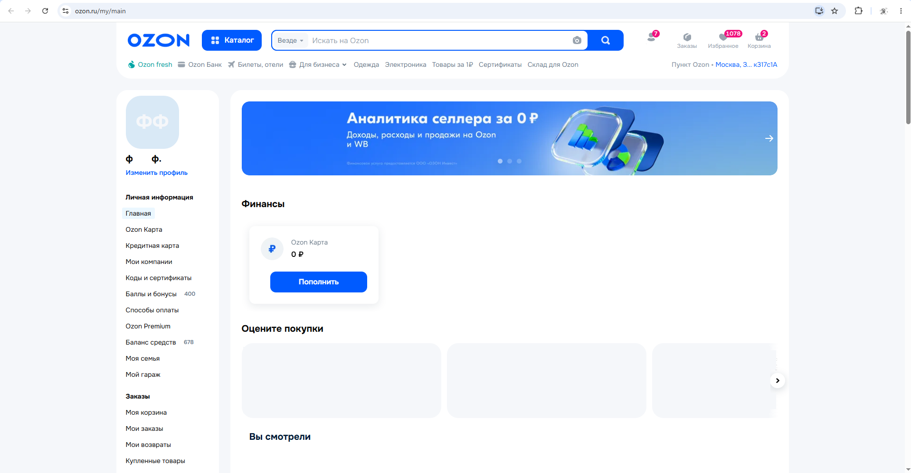

#### Скриншот 2. Главная страница Ozon

На скриншоте показана главная страница маркетплейса с лентой товаров.

#### Скриншот 3. Страница товара

На скриншоте показана страница товара с кнопкой В корзину.

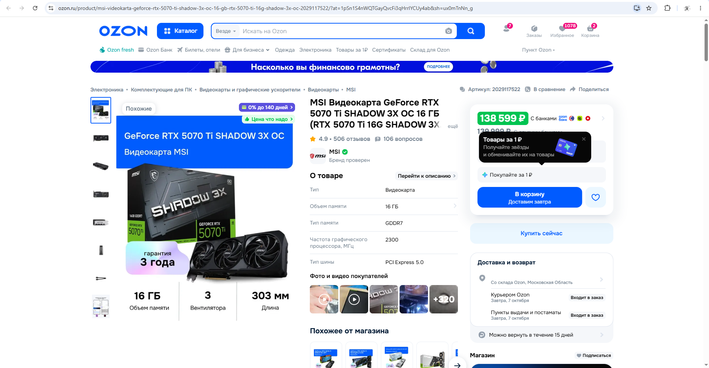

#### Скриншот 4. Корзина

На скриншоте показана корзина добавленных товаров.

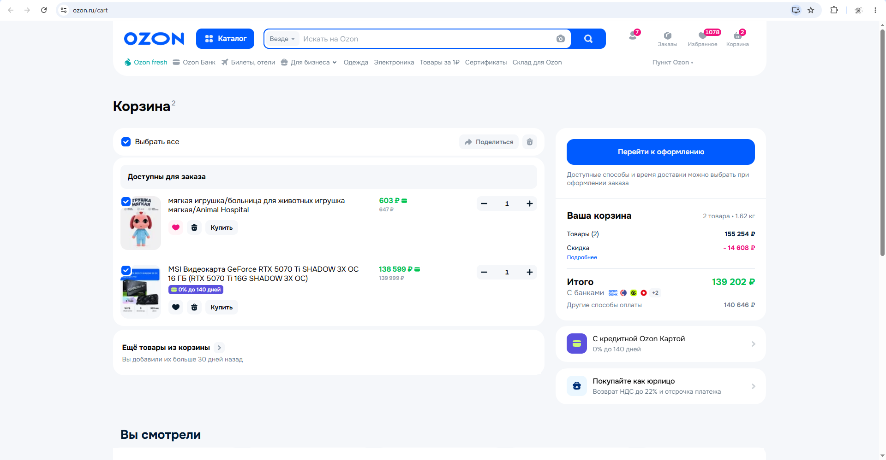

#### Скриншот 5. Заказы

На скриншоте показана страница Заказов.

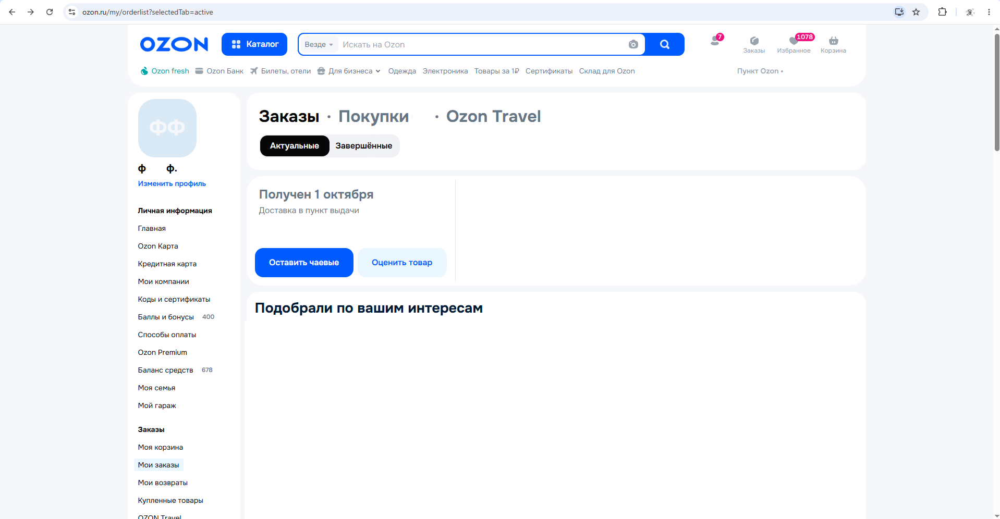

### 2.6. Вывод

В ходе анализа пользовательского интерфейса Ozon были определены основные страницы системы, ключевые элементы управления личным аккаунтом и компоненты заказа товаров.

Выбранный сценарий состоит из следующих основных этапов:

- Авторизация
- Переход на главную страницу
- Выбор товара
- Добавление товара в корзину

Пользовательский интерфейс Ozon построен вокруг скроллинга и алгоритма предложки товаров, чтобы продать как можно больше.

## 3. Анализ клиентской части

### 3.1. Исследование HTML-структуры

Для анализа был выбран элемент интерфейса «Заказы».

Элемент используется для открытия списка заказанных вещей.

Основные характеристики элемента:

- HTML-тег: `
`
- CSS-классы: `d45_4_5-a`
- Текст элемента: «Заказы»
- Вложенные элементы: текст "Заказы" и иконка состоящая из элемента формата svg и пути path.

Скриншот HTML-структуры:

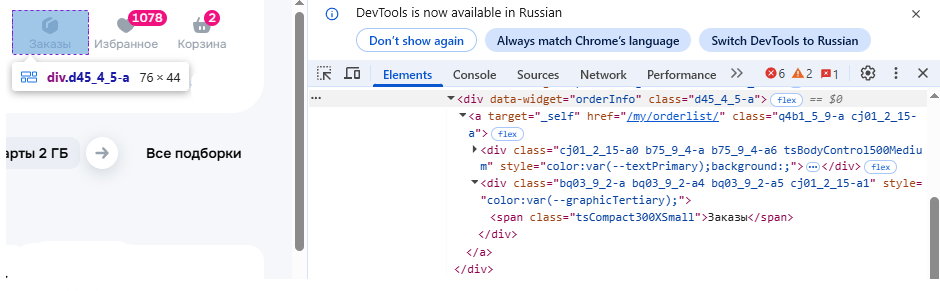

### 3.2. Исследование CSS

Для выбранного элемента были обнаружены CSS-классы, определяющие его внешний вид и положение на странице.

Основные свойства:

| Свойство                 | Назначение                                      |
|--------------------------|-------------------------------------------------|
| `q4b1_5_9-a`             | Плавное изменение свойств			     |
| `cj01_2_15-a`            | Стилизация ссылок				     |
| `cj01_2_15-a0`           | Задает внутренние отступы                       |
| `b75_9_4-a`              | Определяет положение иконки                     |
| `b75_9_4-a6`             | Определяет размер иконки                        |
| `tsBodyControl500Medium` | Определяет характеристики текста                |

Скриншот CSS-стилей:

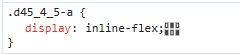

### 3.3. Исследование JavaScript

JavaScript используется для реализации интерактивного поведения редактора.

В разделе **Sources** были обнаружены JavaScript-файлы, загружаемые вместе со страницей.

JavaScript отвечает, в частности, за:

- обработку нажатий пользователя;
- открытие и закрытие элементов интерфейса;
- изменение содержимого страницы;
- взаимодействие с сервером;
- обновление интерфейса без полной перезагрузки страницы.

При нажатии на кнопку Корзина интерфейс реагирует на действие пользователя и открывает корзину товаров.

Скриншот загруженных JavaScript-файлов:

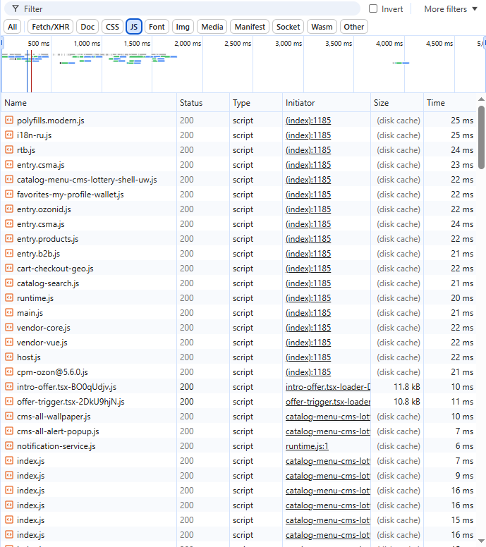

### 3.4. Загружаемые ресурсы

При открытии редактора браузер загружает различные ресурсы, необходимые для работы приложения.

Были обнаружены следующие типы ресурсов:

| Тип        | Пример            | Назначение                        		       |
|------------|-------------------|-----------------------------------------------------|
| Fetch/XHR  | Запросы к серверу | Обмен данными                     		       |
| Document   | HTML-страница     | Загрузка страницы                 		       |
| Stylesheet | CSS-файлы         | Оформление интерфейса              		       |
| Script     | JavaScript-файлы  | Работа клиентской логики          		       |
| Font       | Шрифты            | Отображение текста                		       |
| Image      | Изображения       | Отображение карточек товаров и элементов интерфейса |

### 3.5. Анализ сетевых запросов

При открытии редактора браузер выполняет большое количество сетевых запросов.

Они используются для загрузки интерфейса, JavaScript, CSS, изображений и обмена данными с сервером.

Примеры обнаруженных запросов:

| Метод                                                                   | Тип        | Статус | Назначение               |
|-------------------------------------------------------------------------|------------|--------|--------------------------|
| GET https://www.ozon.ru/?__rr={id}                                      | Document   | 200    | Загрузка страницы        |
| GET https://st.ozone.ru/s3/assets-66613/a0fb041d/catalog-all-		  | Stylesheet | 200    | CSS оформление скроллинга|
|infinite-virtual-paginator.css       					  |            |        |  	                   |
| GET https://st.ozone.ru/s3/assets-66613/a0fb041d/catalog-all		  | Script     | 200    | JS скроллинг             |
|infinite-virtual-paginator.js 					          | 	       |        | 	                   |
| POST https://www.ozon.ru/api/composer-api.bx/_action/summaryV2          | Fetch/XHR  | 200    | Обмен данными с сервером |

### 3.6. Запрос при добавлении товара в корзину

При выполнении сценария «Добавление товара в корзину» в разделе Network были обнаружены дополнительные запросы.

Один из запросов был связан с получением или передачей данных, необходимых для работы редактора.

Основные параметры:

- Метод: `POST`
- Url: `/api/composer-api.bx/widget/json/v2?widgetStateId=orderInfo`
- Тип: `Fetch/XHR`
- Статус: `200 OK`
- Данные запроса: идентификатор состояния виджета информации о товаре
- Ответ: данные в формате JSON, необходимые клиентской части для отображения и обновления состояния виджета

Скриншот запроса:

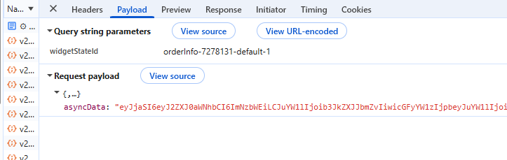

### 3.7. Вывод

В ходе анализа клиентской части Ozon были изучены:

- HTML-структура элемента интерфейса;
- CSS-классы и основные стили;
- JavaScript-файлы и их роль в работе интерфейса;
- загружаемые ресурсы;
- сетевые запросы браузера.

Установлено, что клиентская часть отвечает за отображение маркетплейса, обработку действий пользователя и взаимодействие с
сервером.

При добавлении товара в корзинупользователь выполняет действие в интерфейсе, JavaScript обрабатывает это действие, а
клиентская часть при необходимости выполняет сетевые запросы для получения или сохранения данных.

## 4. Анализ серверной части и API

### 4.1. Серверная часть

Серверная часть Ozon отвечает за операции, которые требуют обработки и хранения данных на сервере.

В рамках выбранного сценария «Добавление товара в корзину» можно предположить выполнение следующих серверных операций:

- получение данных о товаре;
- проверка прав пользователя и состояния его сессии;
-  добавление/обновление товара в корзине пользователя;
- расчет итоговой стоимости корзины;
- загрузка и получение необходимых ресурсов.

Точная внутренняя реализация серверной части недоступна пользователю, поэтому часть выводов основана на наблюдаемых 
сетевых запросах и поведении системы.

### 4.2. Передаваемые данные

При работе редактора между браузером и сервером передаются различные данные.

В зависимости от выполняемого действия это могут быть:

- идентификатор товара;
- идентификатор корзины;
- данные о количестве товара;
- данные пользователя и его сессии;
- данные для сохранения изменений.

Например, при нажатии кнопки «Добавить в корзину» клиентская часть должна передать серверу информацию, необходимую
для определения уникального номера товара, его количества и профиля пользователя, в чью корзину вносятся изменения.

Часть этих данных может передаваться в параметрах URL, заголовках или теле HTTP-запроса.

### 4.3. API и сетевое взаимодействие

В разделе Network были обнаружены запросы типа `Fetch/XHR`.

Они используются клиентской частью для обмена данными с сервером.

Пример наблюдаемого запроса:

| Параметр   | Значение                                                      		|
|------------|--------------------------------------------------------------------------|
| Метод      | POST                                                           		|
| Тип        | Fetch/XHR                                                     		|
| URL        | /api/composer-api.bx/widget/json/v2?widgetStateId=webAddToCart 		|
| Статус     | 200 OK                                                         		|
| Назначение | Передача данных о добавляемом товаре для обновления корзины пользователя |
| Данные     | Идентификатор товара, количество товара, токен авторизации сессии 	|

API позволяет клиентской части отправлять данные на сервер и получать результат обработки.

Скриншот сетевого запроса:

### 4.4. Внешние сервисы

В ходе анализа были обнаружены следующие внешние домены:

| Домен               | Назначение                         |
|---------------------|------------------------------------|
| xapi.ozon.ru        | Обмен данными			   |
| st.ozone.ru	      | Загрузка элементов		   |

### 4.5. Хранилища данных

Внутренние хранилища Ozon непосредственно из браузера не видны.

Однако по функциям системы можно предположить наличие нескольких типов хранилищ:

| Хранилище            | Предполагаемое назначение                                     |
|----------------------|---------------------------------------------------------------|
| База данных          | Хранение пользователей, заказов, корзины и прочего            |
| Файловое хранилище   | Хранение изображений и других загруженных файлов              |
| Кэш                  | Быстрый доступ к часто используемым данным                    |
| Браузерное хранилище | Хранение части данных непосредственно на стороне пользователя |

Эти предположения основаны на функциональности системы. Точная технология хранения данных по результатам внешнего
анализа не определяется.

### 4.6. Общая схема взаимодействия

На основании проведенного анализа можно представить упрощенную схему работы системы:

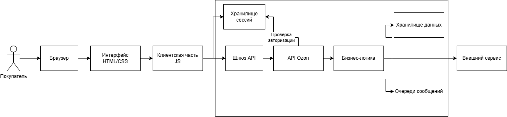

## 5. Описание пользовательского сценария

### 5.1. Выбранный сценарий

Название сценария: поиск товара и добавление в корзину.

Цель сценария: найти товар и добавить его в корзину.

### 5.2. Последовательность выполнения сценария

#### Этап 1. Пользователь открывает страницу

Пользователь загружает главную страницу.

На этом этапе браузер загружает необходимые HTML-, CSS- и JavaScript-ресурсы.

#### Этап 2. Пользователь авторизуется на сайте.

Пользователь нажимает кнопку Войти и входит в аккаунт.

JavaScript обрабатывает действие пользователя и открывает интерфейс авторизации.

#### Этап 3. Пользователь выбирает товар

Пользователь листает ленту и добавляет нужный товар в корзину.

Клиентская часть определяет выбранный пользователем товар и подготавливает данные для отображение его в корзине.

#### Этап 4. Клиентская часть взаимодействует с сервером

При необходимости браузер отправляет запрос на сервер через API.

В запросе могут передаваться данные о ленте, корзине, выбранном товаре и выполняемом действии.

#### Этап 5. Сервер обрабатывает запрос

Сервер принимает запрос и выполняет необходимые операции.

Предположительно, сервер проверяет доступ пользователя к корзине и обрабатывает данные страницы.

Если требуется сохранение изменений корзины, данные записываются в соответствующее хранилище.

#### Этап 6. Сервер возвращает результат

После обработки сервер возвращает результат клиентской части.

Клиент получает необходимые данные и продолжает шоппинг.

#### Этап 7. Интерфейс отображает результат

JavaScript обрабатывает полученный результат и обновляет интерфейс.

Количество товаров в корзине обновляется.

Пользователь видит результат своего действия.

### 5.3. Общая последовательность

Упрощенно сценарий можно представить следующим образом:
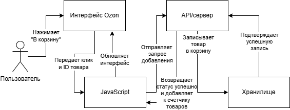

## 6. Построение архитектурной схемы

### 6.1. Архитектурная схема

На схеме представлены основные компоненты:

- пользователь;
- пользовательский интерфейс;
- клиентская часть;
- API;
- поисковый сервис;
- сервис каталога;
- серверная часть;
- cервис корзины;
- хранилище данных;

Схема показывает направление взаимодействия между компонентами при выполнении сценария поиск товара и добавление в корзину.

### 6.2. Взаимодействие компонентов

Основные взаимодействия в системе:

1. Пользователь ищет товар в через каталог или поисковой запрос.
2.a. Поисковой сервер обращается к хранилищу данный для подбора релевантных совпадений.
2.b. Сервис каталога запрашивает подробную информацию по конкретному ID товара.
3. Клиентская часть обрабатывает действия пользователя.
4. При необходимости клиентская часть отправляет запрос через API.
5. Сервер обрабатывает полученный запрос.
6. Сервер обращается к хранилищу данных.
7. Сервер возвращает результат клиентской части.
8. Пользователь нажимает Добавить в корзину
9. Клиентское прилоэение отправляет команду сервису корзины
10. База данных корзин возвращает технический статус об успешной записи данных.
11. Пользователь видит результат выполненного действия.

### 6.3. Архитектурная схема

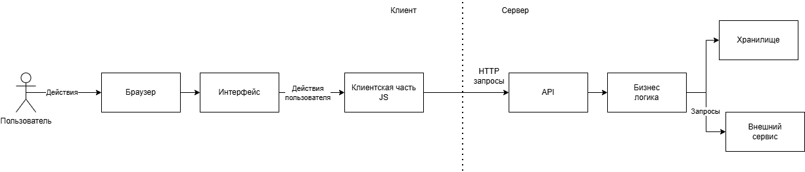

